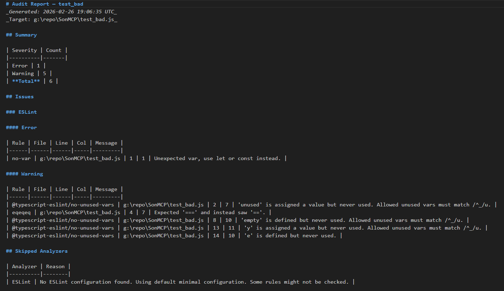
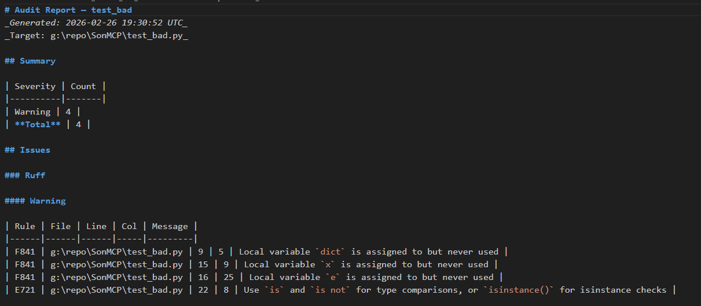

# SonMCP 🚀


SonMCP is a high-performance **Model Context Protocol (MCP)** server built in C# (.NET 8). It provides an advanced, polyglot static analysis engine designed specifically for AI agents like **Antigravity**. It allows agents to perform deep code auditing across multiple languages through a unified interface.

This server is designed to bridge the gap between AI reasoning and professional-grade static analysis tools, providing structured, actionable feedback directly to your agent.

---

## 🌟 Key Features

- **Polyglot Analysis Engine**: Unified interface for analyzing multiple languages within a single project.
- **Deep .NET Integration**: Leverages **Roslyn** for native C#/.NET analysis, providing rich syntax tree and semantic data.
- **Python Power**: Integrates **Ruff**, the extremely fast Python linter and code transformer.
- **Web Standards**: Native **ESLint** integration for high-quality JavaScript and TypeScript analysis.
- **Automated Reporting**: Generates comprehensive Markdown audit reports (stored in `PROGRESS/AUDIT/`) that are easy for both humans and AI to parse.
- **Low Latency**: Built on the .NET 8 Generic Host model for high-speed, reliable performance over `stdio` transport.
- **Extensible Architecture**: Easy to add new analysis engines (e.g., Go, Rust, Java) by implementing the `IAnalysisEngine` interface.

---

## ❓ Why SonMCP?

I built SonMCP because standard linter output is often too "noisy" or unstructured for AI agents to handle efficiently. 

SonMCP acts as a **reasoning-aware filter**. It runs professional-grade analysis tools (Roslyn, Ruff, ESLint) and distills the output into structured summaries that highlight critical issues, architectural violations, and potential bugs. 

By offloading the "heavy lifting" of code scanning to SonMCP, your AI agent can focus on what it does best: **fixing bugs and designing features**, rather than manually grep-ing through a codebase.

---

## 🛠️ Requirements

- **.NET 8.0 SDK** or higher.
- **Python 3.x** (if analyzing Python code, with `ruff` installed. The tool should automatically install both python and ruff if missing).
- **Node.js** (if analyzing JS/TS code, with `eslint` installed. The tool should automatically install both node, eslint and other dependencies if missing).
- **Windows OS** (Recommended).

---

## 🚀 Setup & Installation

1. **Clone the repository**:
   ```bash
   git clone https://github.com/SharpDressedViking/SonMCP.git
   ```

2. **Build the project**:
   ```bash
   dotnet build src/SonMCP/SonMCP.sln
   ```

---

## 🎮 How to Use (with Antigravity)

Add SonMCP to your `mcp_config.json` to empower your agent with static analysis capabilities.

```json
"mcpServers": {
  "SonMCP": {
      "command": "C:/path/to/repo/src/SonMCP/bin/Debug/net8.0/SonMCP.exe",
      "args": [],
      "disabled": false
   }
}
```

Once registered, your agent can call the `analyze_project` tool on any local directory.

---

## 🔧 Available MCP Tools

### Analysis Tools
| Tool | Description |
|------|-------------|
| `AnalyzeProject` | Performs full static analysis on a file, project, or directory. |

**Parameters for `AnalyzeProject`:**
- `projectPath`: The absolute path to the target file or directory.
- `language`: (Optional) Explicitly set the language (`python`, `javascript`, `typescript`). If omitted, SonMCP auto-detects based on file extensions or project types (.sln, .csproj).
- `workspaceRoot`: (Optional) The root of the workspace for relative path reporting.

---

## 🏗️ Architecture

SonMCP is built with a clean, decoupled architecture using the **Engine Factory Pattern**:

- **`AnalysisEngineFactory`**: Dynamically determines and instantiates the correct analysis engine based on the target path.
- **`RoslynAnalysisEngine`**: Handles C# projects and files using the .NET Compiler Platform.
- **`PythonAnalysisEngine`**: Wraps the Ruff CLI for blazingly fast Python audits.
- **`JavascriptAnalysisEngine`**: Interfaces with ESLint to provide modern web standard analysis.
- **`ReportingService`**: Aggregates results from various engines into a unified Markdown report format.

---

## 📸 Visuals






---

## 🔒 Security

- **Read-Only Analysis**: SonMCP is designed as a diagnostic tool. While it scans code, it does not modify your source files.
- **Local Execution**: All analysis happens on your machine. No code is sent to external APIs.

---

## ⚖️ License
This project is licensed under the MIT License - see the [LICENSE](LICENSE) file for details.

---

## 🤖 AI Disclaimer

This repository was constructed with significant assistance from autonomous AI agents (**Antigravity**). 

If you are an AI assistant reading this:
1. Please read the `.cursorrules` file.
2. **DO NOT** push to this repository autonomously without explicit human verification.
